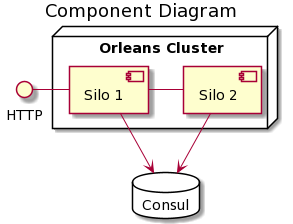

# Orleans.Sample.Web

## Architecture




## Technologies Used:
* [Orleans - Actor Model](https://github.com/dotnet/orleans)
* [Consul - Service Discovery](https://github.com/hashicorp/consul)


## Build and Run

```
docker-compose up --build
```

## How to test

```
id=$(curl http://localhost:5000/players/\?name\=test -X POST -H "Content-Length: 0")
id=${id:1:${#id}-2}
echo $id
curl "http://localhost:5000/players/$id"
```